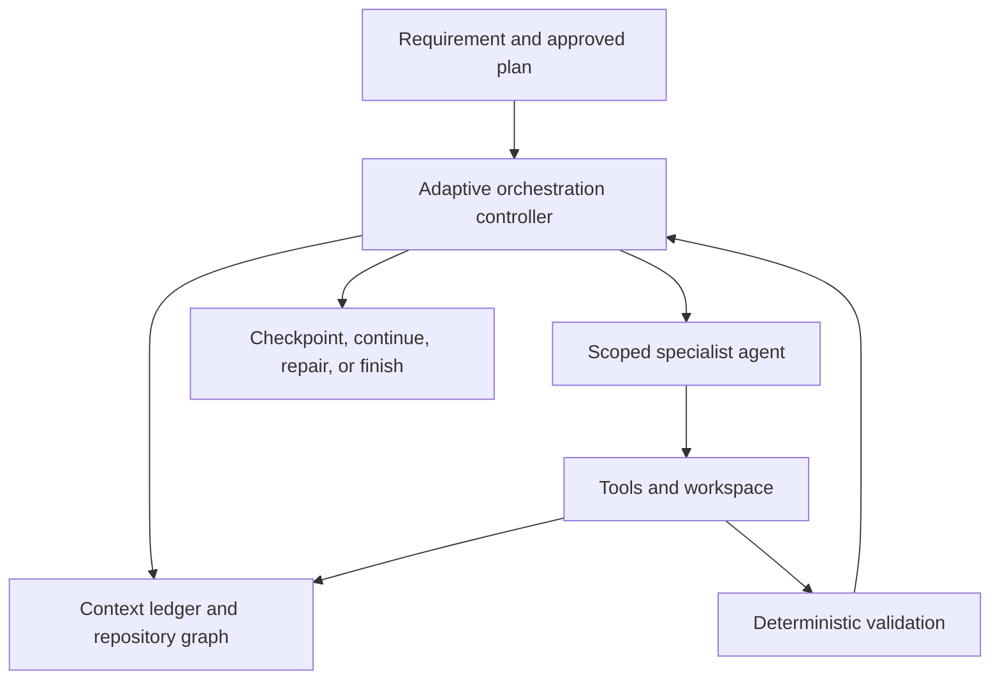

# Nyxara Next

## Research and Open-Source Roadmap

**Status:** Working strategy document  
**Date:** September 2026  
**Repository:** [Nyxara Orchestrator](https://github.com/nnkienn/Nyxara-Orchestrator)  
**Current direction:** Outcome-aware, token-efficient orchestration for long-horizon software engineering

---

## 1. Executive direction

Nyxara should not compete with ChatGPT, Claude, Codex, or other coding agents by merely placing several model calls behind one interface. Its defensible value should be:

> **Complete large software-engineering tasks with less expected token cost per successful outcome, while remaining provider-agnostic, local-first, observable, and recoverable.**

The next stage is therefore not a rewrite and not the immediate addition of more agents. It is a research-driven evolution of the existing workflow:

```text
Planner → Executor → Validation → Reviewer → Repair
```

into an adaptive orchestration system:

```text
Requirement
    ↓
Task contract and dependency graph
    ↓
Adaptive context and execution controller
    ↓
Specialist agents with isolated working views
    ↓
Deterministic validation and evidence-based review
    ↓
Checkpoint, continue, recover, or complete
```

The primary product claim must eventually be supported by evidence:

> For comparable task quality, Nyxara uses fewer tokens or achieves a lower expected cost per successful task than a direct-agent baseline.

Until a controlled benchmark demonstrates this, the claim remains a research hypothesis rather than a marketing statement.

---

## 2. What exists and what is currently blocking Nyxara

Nyxara already has valuable infrastructure that should be preserved:

- provider-independent role routing;
- Planner, Executor, Validation, Reviewer, and Repair boundaries;
- native tool calls and permission enforcement;
- Git-based change evidence;
- deterministic validation before model review;
- bounded evidence and context retrieval;
- workflow state, pause, approval, retry, and usage telemetry;
- fake-provider and opt-in real-provider benchmarks.

The main blocker is the way context and token safety are currently enforced.

### Current behavior

The Executor applies provider-neutral fixed defaults, including:

- approximately 48K estimated input tokens per request;
- 256K cumulative input tokens per attempt;
- 16 provider calls per task;
- 32 KiB of repository context retained after the first round;
- six files and 96 KiB in the default task-context selection.

When the request cannot fit the remaining cumulative allowance, the task ends with an Executor context or total-input error. This protects users from runaway trajectories, but it also turns a cost-control policy into a capability ceiling.

The provider layer already discovers `contextWindow` for supported models, but the Executor does not yet use that capability to derive its working budget. A 32K model and a 200K model therefore pass through essentially the same Executor policy.

### Root design problem

The existing design answers:

> “When should Nyxara terminate to stop token growth?”

The next design must answer:

> “What is the least context and compute required for the next useful action, and how can the task continue safely when one working window is exhausted?”

---

## 3. Non-negotiable design principles

### 3.1 Optimize outcomes, not raw token counts

Using fewer tokens while failing more tasks is not an improvement. Every optimization must be evaluated against correctness, completion, regression safety, latency, and user intervention.

### 3.2 Separate host safety from cost policy

Hard limits should remain for:

- workspace and path boundaries;
- permission checks;
- command timeouts and subprocess output;
- tool-argument and file-write sizes;
- secret handling;
- duplicate/no-progress protection;
- the selected provider's actual context-window boundary.

The following should become adaptive policies rather than terminal product limits:

- cumulative input tokens per task;
- provider calls per task;
- retained working context;
- context expansion count;
- number of continuation segments.

### 3.3 Preserve lossless ground truth outside the prompt

Tool results, file observations, decisions, patches, validation results, and review findings should be stored as structured events. The model receives a task-specific projection, not the complete trajectory.

### 3.4 Expand context on evidence of need

Nyxara should begin with a small working view and expand by path, symbol, dependency edge, failing test, or unresolved decision. Repository-wide retrieval should be exceptional and measurable.

### 3.5 Agents communicate through contracts, not transcripts

Each agent should receive only its role contract, relevant repository projection, current task state, and required evidence. Passing full conversations between agents creates duplication, drift, and hidden cost.

### 3.6 Multi-agent is a treatment, not an assumption

More agents do not automatically produce better work. A specialist agent is introduced only when an ablation demonstrates that it improves expected outcome-adjusted cost or reliability.

### 3.7 Every research result must be reproducible

Configurations, model identifiers, prompts or prompt hashes, repository commits, task definitions, seeds, tool policies, budgets, usage source, and validation outputs must be retained in a privacy-safe experiment manifest.

---

## 4. Target architecture



### 4.1 Model Capability Budget

For each role and selected model, derive the maximum safe request dynamically:

```text
usable_input = model_context_window
             - reserved_output
             - tool_schema_tokens
             - provider_overhead
             - safety_margin
```

If the provider does not report a context window, Nyxara uses a documented conservative fallback and labels the capability as estimated. It must not pretend the value is known.

### 4.2 Context Ledger

Use an append-only, task-scoped event model containing at least:

- repository observations and their revision;
- files, symbols, and dependency edges inspected;
- tool request and bounded result references;
- decisions, assumptions, and unresolved questions;
- patches and changed paths;
- validation and reviewer evidence;
- checkpoints and continuation lineage;
- actual and estimated token usage.

Large payloads remain addressable outside the active prompt. Compaction creates a new projection but never destroys the original event.

### 4.3 Working View Projector

Build a different projection for each role:

| Role | Receives | Does not receive by default |
| --- | --- | --- |
| Planner | requirement, repository map, constraints, prior task outcomes | raw Executor transcript |
| Explorer/Localizer | target question, repository graph, search results | implementation history unrelated to localization |
| Executor | task contract, relevant files/symbols, active decisions, latest evidence | full workflow history |
| Validator | changed paths, commands, repository state | model reasoning |
| Reviewer | requirement, task contract, diff, validation, applicable rules | unrelated source files and raw tool logs |
| Recovery agent | failure state, checkpoint, rejected action alternatives | the entire successful history |

### 4.4 Adaptive Orchestration Controller

At each boundary, the controller chooses one explicit action:

- continue with the current working view;
- retrieve a targeted file, symbol, dependency, or event;
- compact the working view;
- checkpoint and start a continuation segment;
- request an alternative action after failure;
- spawn a specialist agent;
- pause for cost authorization;
- terminate because the task is complete, impossible, unsafe, or genuinely stalled.

This controller should initially be deterministic and observable. Learned policies can be investigated only after sufficient trajectory data exists.

### 4.5 Checkpoint and continuation

Crossing a soft task budget must not erase progress or automatically mark the task failed. Nyxara should write a structured checkpoint containing:

- task contract and completion state;
- repository revision and changed files;
- verified decisions;
- unresolved work;
- next recommended action;
- pointers to recoverable evidence;
- usage accumulated so far.

A new continuation segment receives the checkpoint and a freshly projected working view. Provider-call and token counters remain visible for total-cost reporting, but one segment's context window no longer defines the entire task's maximum size.

### 4.6 Repository Intelligence Graph

The current path/term selector should evolve incrementally toward a lightweight repository graph:

- file and directory structure;
- imports and exports;
- classes, functions, and symbols;
- call and inheritance edges when reliable;
- test-to-source and build-component relationships;
- recent changes and task-specific relevance.

The graph is an index and navigation aid, not a replacement for source-of-truth files. Every edge should be traceable to deterministic repository evidence where possible.

---

## 5. Research questions and hypotheses

### RQ1 — Completion

Can adaptive context and continuation increase success on long-horizon software tasks compared with Nyxara's current fixed terminal budgets?

**H1:** Adaptive Nyxara produces a higher resolved-task rate and Fix Rate on long-horizon tasks without weakening deterministic safety controls.

### RQ2 — Token efficiency

Can Nyxara reduce expected token cost per successful task compared with a direct coding-agent workflow using the same provider and model?

**H2:** Targeted projections and recoverable external context reduce repeated input tokens enough to offset Planner, Reviewer, and orchestration overhead.

### RQ3 — Context management

Which context policy gives the best quality-cost trade-off: fixed truncation, summary compaction, event-ledger projection, or agent-controlled retrieval?

**H3:** Event-ledger projection with targeted retrieval has lower peak context pressure and lower repeated-input ratio than fixed truncation, while retaining or improving task success.

### RQ4 — Multi-agent value

When do specialist agents improve outcomes, and when do coordination costs erase their benefit?

**H4:** Conditional specialist routing outperforms both a monolithic agent and an always-multi-agent configuration on outcome-adjusted cost.

### RQ5 — Generalization

Does the policy remain effective across providers, context-window sizes, languages, repository sizes, and task types?

**H5:** Capability-derived budgets and provider-neutral structured state reduce performance variance across model routes compared with fixed global limits.

---

## 6. Benchmark contract

### 6.1 Required systems

Every core experiment compares at least:

| ID | System | Purpose |
| --- | --- | --- |
| D1 | Direct single agent | Realistic no-Nyxara baseline using the same model and tool permissions |
| N0 | Current Nyxara | Fixed-budget control |
| N1 | Adaptive budget only | Isolate model-capability budgeting |
| N2 | Adaptive budget + Context Ledger | Isolate state projection and recoverability |
| N3 | N2 + continuation | Measure long-horizon completion |
| N4 | N3 + conditional specialists | Measure the true value of multi-agent coordination |

Do not compare Nyxara using one model against a direct baseline using a weaker or differently configured model and claim orchestration gains.

### 6.2 Task groups

Use three levels:

1. **Deterministic microtasks** — context selection, compaction, continuation, permissions, and failure recovery.
2. **Nyxara controlled repository tasks** — small, medium, heavy, and repair-heavy tasks with hidden acceptance tests.
3. **External long-horizon tasks** — selected tasks from suitable public benchmarks such as SWE-EVO, RoadmapBench, or DeepSWE, subject to their licenses and execution requirements.

Task strata should include:

- localized bug fixes;
- multi-file features;
- refactors with behavioral preservation;
- dependency or framework upgrades;
- tasks requiring exploration before modification;
- tasks with validation and repair cycles.

### 6.3 Primary metrics

```text
Resolved Rate = successful runs / all runs

Outcome-Adjusted Token Cost = total tokens across all runs / successful runs

Outcome-Adjusted Monetary Cost = total provider cost across all runs / successful runs

Repeated Input Ratio = repeated prompt/input tokens / total input tokens

Context Utilization = useful evidence referenced in action / active working-view evidence
```

Also report:

- input and output tokens separately;
- provider calls and tool calls;
- validation/test pass rate;
- partial Fix Rate for large tasks;
- wall-clock latency and time to first useful change;
- peak context pressure;
- number of expansions, compactions, checkpoints, and continuations;
- no-progress and coordination failures;
- human approvals or interventions;
- changed-file precision and unrelated-change rate.

Raw token savings must never be reported without resolved rate.

### 6.4 Experimental discipline

- Pin the repository commit, task, model revision, provider settings, and tool policy.
- Use the same task order and environment for paired comparisons.
- Run multiple trials because agent token consumption is stochastic.
- Begin with three pilot repetitions; target at least ten repetitions for final small/medium-task comparisons when cost permits.
- Report median, dispersion, and 95% confidence intervals rather than only the best run.
- Use paired bootstrap or permutation intervals for continuous metrics and paired success analysis for pass/fail outcomes.
- Publish failures and incomplete trajectories in privacy-safe form; do not remove them from averages.
- Mark provider-reported, estimated, and unavailable token usage separately.
- Keep a holdout task set that is not used to tune prompts or policies.

### 6.5 Benchmark work required in the current repository

The existing harness is a useful base but must be extended to:

- execute a direct-agent baseline;
- compare token and cost metrics, not only duration and memory;
- verify functional equivalence through tests or task verifiers;
- retain per-round request size and repeated-input estimates;
- record policy decisions and continuation lineage;
- compare success-normalized metrics;
- produce an ablation table automatically;
- refuse invalid comparisons when model, task, repository commit, or permissions differ.

---

## 7. Phased implementation roadmap

The phases are evidence gates. A phase is complete only when its implementation, tests, measurements, and documentation are complete.

### Phase 0 — Freeze and reproduce the baseline

**Goal:** Preserve the current behavior as an experimental control and reproduce the large-task failure.

**Work:**

- record the exact failing task, provider, model, context window, error code, and usage;
- create a deterministic regression scenario that reaches the current cumulative-input failure;
- snapshot N0 metrics and current benchmark reports;
- document all fixed limits and classify each as host safety, provider constraint, cost policy, or algorithmic heuristic;
- add no new agents and change no limits during baseline capture.

**Exit gate:** The failure is reproducible, tests distinguish local policy rejection from provider context rejection, and the baseline report can be regenerated.

### Phase 1 — Build the scientific benchmark

**Goal:** Make every following optimization measurable.

**Work:**

- implement D1 direct-agent mode;
- add token, cost, success, Fix Rate, repeated-input ratio, and per-round context metrics;
- introduce experiment manifests and comparability validation;
- add paired report comparison and ablation output;
- create controlled small, medium, and long-task fixtures.

**Exit gate:** One command can compare D1 and N0 on identical conditions and clearly state when a comparison is invalid.

### Phase 2 — Capability-derived adaptive budget

**Goal:** Stop treating every model as if it has the same context capacity.

**Work:**

- connect resolved `ModelInfo.contextWindow` to Core budgeting;
- reserve space for output, tool schemas, conversation envelopes, and provider overhead;
- define behavior for unknown or stale model capabilities;
- make cumulative tokens a soft budget and telemetry signal;
- retain hard enforcement of the provider's per-request capacity and host safety constraints;
- introduce cost-policy modes such as `economy`, `balanced`, and `completion`, expressed as policy targets rather than arbitrary token ceilings.

**Exit gate:** Large requests fit or compact based on the selected model's actual capacity; budget exhaustion produces a checkpoint/policy decision rather than an unrecoverable Executor failure.

### Phase 3 — Context Ledger and working-view projections

**Goal:** Reduce prompt replay without losing recoverability.

**Work:**

- define versioned context-event schemas;
- store large evidence by reference;
- create deterministic role-specific projectors;
- track evidence provenance and repository revision;
- implement retrieval of evicted information by event address, path, symbol, or dependency;
- measure repeated input and evidence reuse.

**Exit gate:** Executor rounds no longer require replaying the full fixed prompt/context; evicted evidence can be recovered; N2 improves repeated-input ratio without a statistically meaningful correctness regression.

### Phase 4 — Checkpointed continuation

**Goal:** Allow tasks to exceed one attempt's context or call budget safely.

**Work:**

- define checkpoint and continuation schemas;
- continue from a fresh working view while retaining total usage accounting;
- verify workspace integrity at continuation boundaries;
- make continuation idempotent where possible;
- distinguish `paused_for_budget`, `continued`, `stalled`, `unsafe`, and `failed` states;
- expose clear UI information and user-controlled cost authorization.

**Exit gate:** The original large-task regression completes or reaches a truthful task-level failure unrelated to Nyxara's former fixed cumulative cap.

### Phase 5 — Repository graph and specialized localization

**Goal:** Improve the precision of context acquisition before adding broad multi-agent execution.

**Work:**

- create a deterministic lightweight repository graph;
- add path, symbol, import, call, test, and build relationships incrementally;
- introduce an Explorer/Localizer role only for tasks where the current controller detects localization uncertainty;
- compare graph-guided retrieval with the current term/path selector;
- keep an escape hatch to direct source inspection when the graph is incomplete.

**Exit gate:** Localization accuracy and downstream task success improve, or equivalent success is achieved at lower context/token cost.

### Phase 6 — Conditional multi-agent execution

**Goal:** Add specialists only where coordination has measurable value.

**Candidate roles:**

- Architect/Planner;
- Explorer/Localizer;
- Implementer assigned to a task or component;
- Validator, deterministic by default;
- Reviewer;
- Recovery agent for alternative actions;
- Orchestration controller as the sole authority over task state.

**Coordination contract:**

- one structured task contract;
- explicit file or component ownership;
- dependency-aware scheduling;
- no hidden shared transcript;
- Git/repository revision attached to evidence;
- agents cannot independently declare global completion;
- Core validation and controller termination remain authoritative.

**Experiments:**

- monolithic agent versus always-multi-agent versus conditional specialists;
- sequential versus safe parallel execution;
- shared transcript versus isolated projections;
- one Architect versus competing designs only for architecture-heavy tasks;
- standard retry versus alternative-action recovery inspired by adaptive search.

**Exit gate:** N4 improves outcome-adjusted cost, resolved rate, or robustness on a predefined task stratum. If not, the specialist remains experimental and disabled by default.

### Phase 7 — Research release

**Goal:** Turn engineering evidence into a publishable technical contribution.

**Artifacts:**

- research question and preregistered evaluation plan;
- versioned benchmark suite and task manifest;
- baselines and ablations;
- statistical analysis scripts;
- anonymized/privacy-safe trajectories;
- failure taxonomy mapped to observed Nyxara failures;
- limitations, threats to validity, and negative results;
- technical report or preprint with a reproducibility appendix.

**Exit gate:** An external developer can reproduce the headline tables from a tagged commit and documented environment.

### Phase 8 — Open-source release candidate

**Goal:** Make Nyxara safe and understandable for outside users and contributors.

**Required repository work:**

- select and add a real license; Apache-2.0 is a strong candidate when an explicit patent grant is desirable, but the final choice should reflect all contributors and reused components;
- add `CONTRIBUTING.md`, `CODE_OF_CONDUCT.md`, `SECURITY.md`, and `CITATION.cff`;
- publish architecture and threat-model documentation;
- document provider capability uncertainty and cost controls;
- add setup, quickstart, examples, troubleshooting, and bilingual entry documentation;
- define semantic versioning, support policy, and release notes;
- provide a plugin/provider contribution contract;
- add CI for build, unit tests, integration tests, benchmark smoke tests, secret scanning, dependency review, and package/VSIX verification;
- publish benchmark limitations and avoid unsupported cost-saving claims;
- create issue templates for provider adapters, context failures, benchmark tasks, and security reports.

**Exit gate:** A clean machine can install Nyxara, configure a provider locally, execute a controlled task, understand every permission request, reproduce a benchmark smoke run, and report a failure without exposing secrets.

---

## 8. Suggested milestone sequence

| Milestone | Outcome | Recommended scope |
| --- | --- | --- |
| M0 — Baseline | Reproducible current failure and valid N0 measurements | 1–2 weeks |
| M1 — Measurement | Direct baseline and outcome-adjusted comparison | 2–3 weeks |
| M2 — Elastic Budget | Model-aware request budgeting and soft task budgets | 2–4 weeks |
| M3 — Durable Context | Context Ledger and role projections | 4–6 weeks |
| M4 — Long Horizon | Checkpointed continuation and large-task recovery | 3–5 weeks |
| M5 — Localization | Repository graph and conditional Explorer | 3–5 weeks |
| M6 — Multi-Agent | Conditional specialists and coordination ablations | 4–8 weeks |
| M7 — Research/OSS | Reproducible report and release candidate | 4–8 weeks |

These are planning ranges, not deadlines. Research tasks should be gated by evidence rather than completed merely because a calendar period elapsed.

---

## 9. First implementation slice

The first code change after baseline capture should be deliberately small:

1. Add a `ModelContextProfile` resolved from the selected model.
2. Compute and emit the usable input budget for each Executor request.
3. Keep current limits available as the N0 compatibility policy.
4. Add an experimental adaptive policy behind an explicit feature flag.
5. Change cumulative-token exhaustion in the experimental path from terminal failure to a structured `checkpoint_required` result.
6. Add tests proving that host safety remains enforced.
7. Run D1, N0, and N1 on the same controlled task.

Do not combine Context Ledger, parallel agents, new UI, and budget changes in the same first patch. That would prevent causal evaluation and make regressions difficult to localize.

---

## 10. Decision log to create immediately

Create Architecture Decision Records for:

- **ADR-001:** Host safety limits versus orchestration policy budgets.
- **ADR-002:** Model capability discovery and conservative fallback.
- **ADR-003:** Append-only Context Ledger and evidence provenance.
- **ADR-004:** Role-specific working-view projection.
- **ADR-005:** Checkpoint and continuation semantics.
- **ADR-006:** Conditions for spawning specialist agents.
- **ADR-007:** Direct-agent benchmark fairness contract.
- **ADR-008:** Privacy-safe research trajectory release.
- **ADR-009:** Project license and third-party asset/data compliance.

Every ADR should document context, decision, alternatives, consequences, metrics affected, and rollback strategy.

---

## 11. What Nyxara should not do

- Do not remove permissions, path constraints, process bounds, or provider-window checks in the name of supporting large tasks.
- Do not simply raise 48K to 128K and 256K to a larger number; that postpones the same failure.
- Do not send the full repository or full trajectory on every round.
- Do not spawn one agent per file without measured benefit and ownership rules.
- Do not use different models or permissions for Nyxara and the direct baseline.
- Do not report only successful runs or select the cheapest successful seed.
- Do not claim token savings from synthetic usage alone.
- Do not train a context policy before enough high-quality trajectories and outcome labels exist.
- Do not publish benchmark tasks, code, or datasets without checking their licenses.
- Do not invite contributions while the repository still says `License TBD`.

---

## 12. Research foundations to study

The following works map directly to Nyxara's roadmap:

1. **Li et al. (2026), [ACM: Agentic Context Management for Long Horizon Tasks](https://arxiv.org/abs/2607.23809).** Agent-controlled context editing, offloading to external memory, and on-demand recovery. Relevant to the Context Ledger and adaptive working view.

2. **Lin et al. (2026), [Context as an Environment: Programmatic Context Management for Long-Horizon Agents](https://arxiv.org/abs/2608.21690).** Append-only event log, persistent typed state, and explicit projection into the active context. This is the closest conceptual basis for Nyxara's proposed event-ledger architecture.

3. **Bai et al. (2026), [How Do AI Agents Spend Your Money?](https://arxiv.org/abs/2604.22750).** Shows that input tokens dominate agentic cost, runs can vary greatly, and more tokens do not guarantee greater accuracy. Supports outcome-adjusted evaluation and repeated trials.

4. **Wang et al. (2026), [CodeTeam](https://arxiv.org/abs/2606.22082).** Uses structured design contracts, project-specific agents, dependency-aware scheduling, and Git coordination. Relevant to later multi-agent phases, not a reason to add agents before the context layer is stable.

5. **Cemri et al. (2025), [Why Do Multi-Agent LLM Systems Fail?](https://arxiv.org/abs/2503.13657).** Identifies specification, inter-agent alignment, verification, and termination failures. Its taxonomy should inform Nyxara's multi-agent tests and telemetry.

6. **Chen et al. (2025), [LocAgent](https://aclanthology.org/2025.acl-long.426/).** Graph-guided repository localization with strong cost reductions in the reported setting. Relevant to Nyxara's repository graph and conditional Explorer role.

7. **Aggarwal et al. (2025), [DARS](https://aclanthology.org/2025.acl-long.973/).** Adaptive re-sampling after suboptimal actions. Relevant to recovery choices and alternative-action search rather than repeating an identical failed trajectory.

8. **Zhang et al. (2026), [Agentic Context Engineering](https://arxiv.org/abs/2510.04618).** Structured, incremental context evolution that resists information collapse. Relevant to project-level playbooks and learning from validated execution feedback.

9. **Thai et al. (2025), [SWE-EVO](https://arxiv.org/abs/2512.18470).** Long-horizon, multi-file software evolution and partial Fix Rate. Useful for evaluating continuation beyond isolated bug fixes.

10. **Xu et al. (2026), [RoadmapBench](https://arxiv.org/abs/2605.15846).** Large version-upgrade tasks across repositories and languages. Useful as a high-difficulty external evaluation tier.

11. **Huang et al. (2026), [DeepSWE](https://arxiv.org/abs/2607.07946).** Original long-horizon tasks with hand-written verifiers designed to reduce contamination and grading ambiguity.

12. **Cherny-Shahar and Yehudai (2026), [Repository Intelligence Graph](https://arxiv.org/abs/2601.10112).** Deterministic, evidence-backed architectural maps for build and test structure. Relevant to traceable repository intelligence.

Nyxara may implement ideas described in research papers without asking the authors for permission. Permission and attribution obligations arise when reusing their code, datasets, benchmarks, model checkpoints, figures, or substantial text; each artifact's actual license must be reviewed separately.

---

## 13. Definition of success

Nyxara's next research stage succeeds when all of the following are true:

- a task is not rejected merely because it exceeds a global fixed cumulative-token ceiling;
- every request respects the selected model's real usable context window;
- long tasks can checkpoint and continue without replaying the complete history;
- deterministic safety and permission controls remain intact;
- Nyxara reports actual outcome-adjusted cost and uncertainty;
- direct and orchestrated runs can be compared fairly and reproducibly;
- multi-agent specialists are enabled only where experiments demonstrate value;
- external users can install, understand, inspect, reproduce, and contribute to the system under a clear license;
- research conclusions include failures, limitations, and negative results.

The long-term identity of Nyxara should be:

> **An open, provider-agnostic experimental platform for reliable and token-efficient long-horizon software-engineering agents — backed by measurable outcomes rather than fixed token ceilings or unverified multi-agent claims.**

---

## 14. Immediate next session checklist

When returning to the development machine:

- [ ] Record the exact large task prompt and approved plan.
- [ ] Export the Executor error code and safe usage metrics.
- [ ] Record provider, requested model, resolved model, and discovered context window.
- [ ] Pin the current Nyxara commit as N0.
- [ ] Turn the failure into a deterministic regression test.
- [ ] Run the current real-workflow benchmark once without changing limits.
- [ ] Create the Phase 1 benchmark branch.
- [ ] Implement direct-agent baseline before adaptive orchestration.
- [ ] Select a project license before inviting outside contributions.
- [ ] Open ADR-001 and ADR-007 before changing Executor behavior.

This checklist is the starting point. The first objective is not to make the error disappear; it is to preserve the error as a baseline, replace its cause with an adaptive design, and demonstrate the improvement scientifically.
